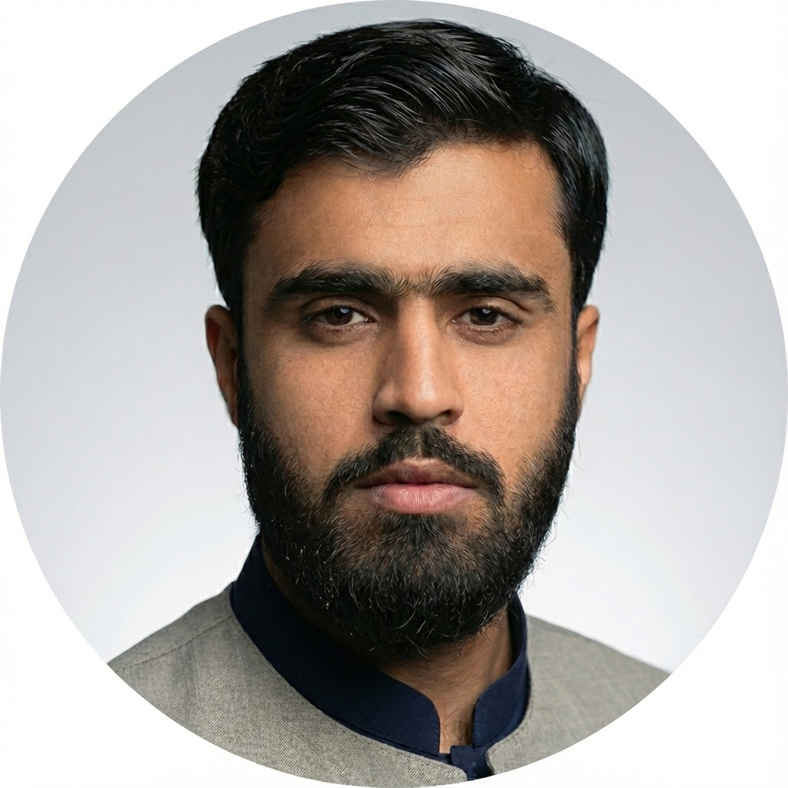

 <p align="center">
  
</p>

## 🚀 About Me

I am **Syed Najmuddin**, currently pursuing a Bachelor of Science in **Information Technology** (7th Semester).. My academic interests lie at the intersection of computing, web engineering, and data analysis, with a focus on mastering modern frameworks and software development methodologies.

## 🎓 Education

| Institution | Degree | Duration |
| :--- | :--- | :--- |
| University of Balochistan | Bachelor's (BS IT) | 2022-12 - 2026-12 |

### Bachelor's in Information Technology
*University of Balochistan, Quetta, Pakistan*

## 📞 Contact & Links

* 📬 How to reach me: [aghasyednajmuddin@gmail.com](mailto:aghasyednajmuddin@gmail.com) ```
* ## 🌐 Connect with Me

<a href="YOUR_LINKEDIN_URL" target="_blank"></a>
<a href="https://www.instagram.com/syednajmuddinagha?igsh=MWdzN2U0ZHZ6cmJ0Zw==" target="_blank"></a>
<a href="https://www.facebook.com/share/17RCuws3cM/" target="_blank"></a>
<a href="https://wa.me/923317572367" target="_blank"></a>

## 🛠️ Skills & Technologies

### 💻 Frontend Development
  

### ⚙️ Programming Languages
  

### 🗄️ Backend Development


### 📊 Database


 ## 🎯 Interests & Focus Areas

**💻 Web Engineering** &nbsp;|&nbsp; **📊 Data Analysis** &nbsp;|&nbsp; **🔧 Automation** &nbsp;|&nbsp; **🛡️ Cybersecurity**

<br>

   
 
---

 
